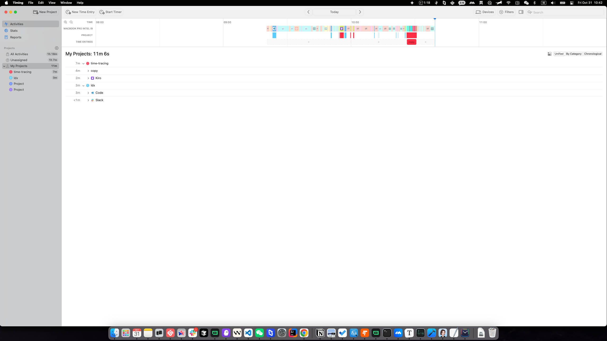
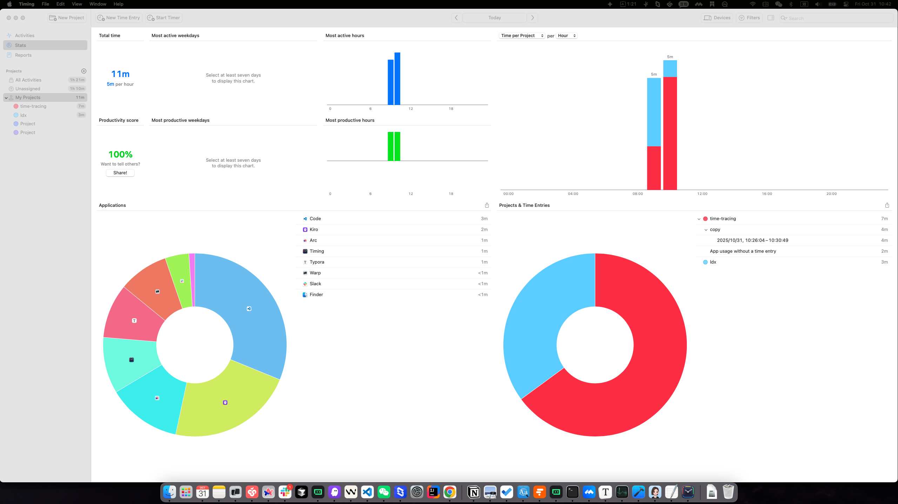
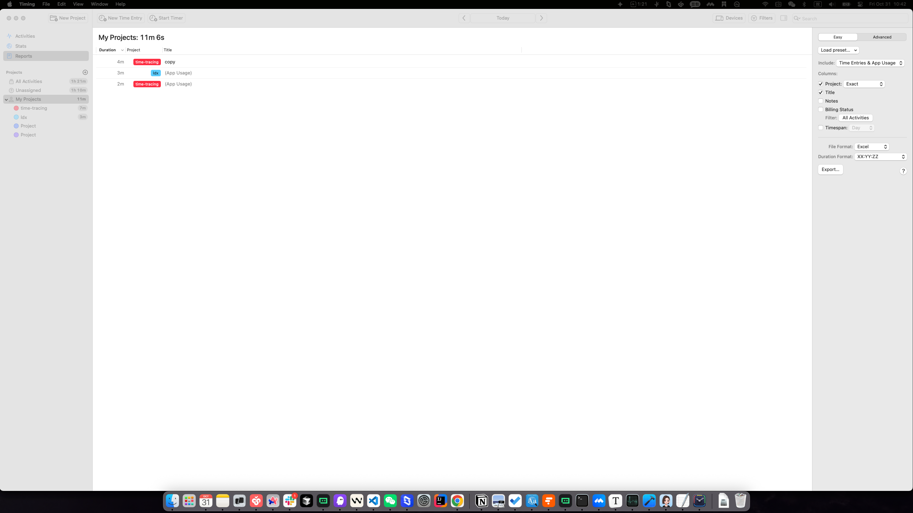

# UI/UX Interaction Specification: Timing App

## 1. Executive Summary

The Timing App is a macOS time-tracking application designed for automatic activity monitoring and productivity analytics. It provides users with comprehensive visibility into how they spend their time, broken down by application usage, projects, and various activity categories.

**Design Language**: Professional, data-centric, minimalist with a clean white/light UI. The interface prioritizes information density without sacrificing readability. Uses a modern macOS native design aesthetic with system fonts and icons (SF Pro Display/Text). The app follows macOS Human Interface Guidelines with native controls and familiar interaction patterns.

**Core Purpose**: Passively track computer activity, categorize time into projects, and provide detailed analytics and reporting on productivity metrics.

---

## 2. Global UI Standards (Design System)

### 2.1 Layout Grid

The application uses a **three-column split-view architecture**:

1. **Left Sidebar (Fixed Width: ~260px)**
   - Contains main navigation tabs and project/activity listing
   - Height: Full viewport minus toolbar
   - Scrollable content area for project lists

2. **Center Content Area (Fluid Width: Variable)**
   - Displays main view content (Activities, Stats, or Reports)
   - Contains the primary data visualization or list views
   - Responsive to window resizing

3. **Right Panel (Optional, variable width)**
   - Appears in Reports view for filter/export controls
   - Collapsible configuration panel
   - Width: ~280px when visible

**Toolbar**: Fixed-height header bar
- Height: 52px
- Sticky position at top
- Contains global navigation buttons and date range controls

**Grid System**: 8px base unit
- Padding: Multiples of 8px (8, 16, 24, 32px)
- Component spacing: 8-16px between related items
- Column gaps: 16-24px

### 2.2 Color Palette

#### Primary Colors
- **Background**: `#FFFFFF` (White) - Main canvas
- **Surface Secondary**: `#F5F5F5` (Light Gray) - Secondary surfaces, table headers
- **Text Primary**: `#1D1D1D` (Dark Gray-Black) - Body text, primary labels
- **Text Secondary**: `#666666` (Medium Gray) - Secondary labels, helper text
- **Text Tertiary**: `#999999` (Light Gray) - Disabled text, metadata

#### Accent Colors
- **Blue**: `#007AFF` (System Blue) - Links, selected states, interactive elements
- **Gray**: `#999999` - Neutral interactive elements, borders
- **Light Border**: `#E5E5E5` - Subtle dividers, table borders

#### Utility Colors
- **Success**: `#34C759` (Green) - Positive indicators (not heavily used)
- **Warning**: `#FF9500` (Orange) - Warnings/alerts (minimal usage)
- **Error**: `#FF3B30` (Red) - Error states, destructive actions
- **Disabled**: `#D0D0D0` (Light Gray) - Disabled controls

#### Contextual Colors (Metadata Indicators)
- **Icon Tints**: Various application icons rendered in color (e.g., app-specific colors)
- **Productivity Indicators**: Subtle color coding (productivity score percentages)

### 2.3 Typography

#### Font Family
- **Primary Font**: `-apple-system, BlinkMacSystemFont, "SF Pro Display", "SF Pro Text", sans-serif` (macOS system fonts)
- Fallback: System fonts available on macOS 10.12+

#### Type Scale
| Element | Size | Weight | Line Height | Usage |
|---------|------|--------|-------------|-------|
| H1 (Page Title) | 24px | 600 (Semibold) | 28px | View titles, major headings |
| H2 (Section Title) | 18px | 600 (Semibold) | 22px | Section headers, widget titles |
| H3 (Subsection) | 16px | 600 (Semibold) | 20px | Column headers, subheadings |
| Body Regular | 14px | 400 (Regular) | 20px | Default text, descriptions |
| Body Small | 13px | 400 (Regular) | 18px | Secondary text, labels, metadata |
| Caption | 12px | 400 (Regular) | 16px | Helper text, timestamps |
| Monospace (Data) | 13px | 400 (Regular) | 18px | Time values, duration displays |

#### Font Weight
- **400**: Regular (default body text)
- **500**: Medium (rarely used, emphasis in tables)
- **600**: Semibold (headings, labels, selected states)
- **700**: Bold (not commonly used, very rare emphasis)

### 2.4 Iconography

**Icon System**: SF Symbols (Apple's native icon system)
- **Size**: Typically 16x16px, 18x18px, or 24x24px
- **Style**: Line-weight icons, single-stroke design
- **Color**: Inherits text color context (`#1D1D1D` primary, `#666666` secondary)
- **Consistency**: All icons use consistent stroke weight and visual balance

**Common Icons Used**:
- Navigation icons (Activities, Stats, Reports) - 24x24px
- Disclosure triangles (for expandable rows) - 15x15px
- Project/application icons (small avatars) - 18x18px
- Application/process icons (from system app icons) - 16-18px
- Search/clear buttons - 16x16px
- Menu/gear icon for settings - 16x16px

**Application Icons**: Full-color icons rendered at 18-24px, sourced from system application bundles.

### 2.5 Common Components

#### 2.5.1 Buttons

**Primary Button (CTA)**
- **Default State**:
  - Background: `#007AFF`
  - Text: White (`#FFFFFF`)
  - Padding: 8px 16px
  - Border Radius: 4px
  - Font: 14px, Semibold
- **Hover State**: Background lightens to `#0051D5`
- **Active/Pressed State**: Background darkens slightly, slight visual depression
- **Disabled State**: Background `#D0D0D0`, text `#999999`, no interaction

**Secondary Button**
- **Default State**:
  - Background: `#F5F5F5` or transparent
  - Text: `#1D1D1D`
  - Border: 1px solid `#E5E5E5`
  - Padding: 8px 16px
  - Border Radius: 4px
- **Hover State**: Background `#EBEBEB`
- **Active State**: Background slightly darker
- **Disabled State**: Border and text in disabled color

**Icon Button**
- **Size**: 16x16px or 24x24px icon in center
- **Padding**: 8px (creates 24-32px total clickable area)
- **Background**: Transparent by default
- **Hover State**: Light gray background circle (`#F5F5F5`)
- **Active State**: Darker background and tinted icon

#### 2.5.2 Text Inputs

**Default State**:
- Background: White (`#FFFFFF`)
- Border: 1px solid `#E5E5E5`
- Padding: 8px 12px
- Font: 14px Regular
- Text Color: `#1D1D1D`
- Border Radius: 4px
- Height: 32-36px

**Focused State**:
- Border: 2px solid `#007AFF`
- Padding adjusted to account for border: 7px 11px
- Box shadow: `0 0 0 3px rgba(0, 122, 255, 0.1)`
- Background: White

**Placeholder Text**:
- Color: `#999999`
- Font Style: Regular (not italicized)

**Disabled State**:
- Background: `#F5F5F5`
- Border: 1px solid `#E5E5E5`
- Text: `#999999`
- Cursor: Not allowed

#### 2.5.3 Checkboxes & Radio Buttons

**Checkbox**:
- **Size**: 16x16px
- **Default State**: Outlined square, border `#999999`, white fill
- **Checked State**: Blue fill (`#007AFF`) with white checkmark
- **Hover State**: Slightly darker border
- **Disabled State**: Gray border and checkmark
- **Label Spacing**: 8px right of checkbox

**Radio Button**:
- **Size**: 16x16px
- **Default State**: Outlined circle, border `#999999`
- **Selected State**: Blue outer circle with smaller blue filled circle inside
- **Hover State**: Darker border on hover
- **Disabled State**: Gray styling

#### 2.5.4 Dropdown / Popup Menus

**PopUp Button (Dropdown)**:
- **Background**: `#F5F5F5` or white
- **Border**: 1px solid `#E5E5E5`
- **Padding**: 6px 12px
- **Font**: 13-14px Regular
- **Border Radius**: 4px
- **Chevron Icon**: Rendered on right side, rotates on click
- **Height**: 32px

**Menu Items**:
- **Default State**: Transparent background, black text
- **Hover State**: Light blue background (`#F0F8FF`)
- **Selected State**: Checkmark or highlight, blue tint
- **Separator**: 1px solid `#E5E5E5`
- **Padding**: 8px 16px per menu item

**Menu Appearance**:
- Background: White (`#FFFFFF`)
- Border: 1px solid `#E5E5E5`
- Shadow: Subtle drop shadow (`0 4px 12px rgba(0, 0, 0, 0.08)`)
- Border Radius: 6px
- Appears below/above trigger, with auto positioning

#### 2.5.5 Tables & Data Lists

**Table Header**:
- Background: `#F5F5F5`
- Text: `#1D1D1D`, 13px Semibold
- Padding: 12px
- Border Bottom: 1px solid `#E5E5E5`
- Column Alignment: Left-aligned (except time/duration: right-aligned)
- Height: 28-32px

**Table Row (Default)**:
- Background: White
- Height: 31px
- Padding: 8px 12px
- Border Bottom: 1px solid `#F5F5F5` or `#E5E5E5`
- Text: 14px Regular

**Table Row (Hover)**:
- Background: `#F9F9F9` (very subtle highlight)
- Slight elevation/shadow suggestion

**Table Row (Selected)**:
- Background: `#E3F2FD` (very light blue)
- Text: `#1D1D1D` (no color change)

**Row Disclosure Triangle**:
- Position: Left of row content
- Size: 15x15px
- Color: `#666666`
- Rotates 90° when expanded

**Alternating Row Colors**: Minimal - rows alternate between white and `#F9F9F9`

#### 2.5.6 Scroll Areas

**Scrollbar**:
- **Style**: Overlay scrollbar (appears on hover/scroll, disappears when idle)
- **Width**: 8px
- **Color**: `#999999` with slight transparency
- **Hover Color**: `#666666`
- **Border Radius**: 4px (rounded ends)
- **Padding**: 2px from edge
- **Background Track**: Transparent, appears only when scrollbar is visible

#### 2.5.7 Status Indicators & Badges

**Time Duration Display**:
- Font: 13px Monospace Regular
- Color: `#1D1D1D`
- Format: "XXm", "XXh XXm", "XXh XXm XXs"
- Right-aligned in table columns

**Category/Project Tags**:
- Small inline labels
- Background: Very light gray (`#F5F5F5`)
- Border: 1px solid `#E5E5E5`
- Padding: 4px 8px
- Border Radius: 4px
- Font: 12px Regular

---

## 3. Main Views / Screen Layouts

### 3.1 Activities View

**Purpose**: Display detailed chronological list of all tracked activities and time entries. Allows users to browse, search, and filter their activity history. Serves as the main data entry and editing interface.


*Figure 1: Activities View displays the core time-tracking interface with a left sidebar for project navigation (260px fixed width), and the main content area showing a two-column activity list. The toolbar at the top provides date range controls and search functionality. This view allows users to see all tracked activities, expand/collapse activity groups, and manage project assignments.*

**Visual Hierarchy & Layout**:

```
┌────────────────────────────────────────────────────────────────────┐
│ Toolbar (52px)                                                      │
│ [Menu] [Activities] [Stats] [Reports] | [Date Range] [Search] [...] │
├──────────────────┬──────────────────────────────────────────────────┤
│ Sidebar (260px)  │ Main Content Area (Fluid)                        │
│                  │                                                  │
│ [Projects]       │ [Summary Info] [View Options] [Search]           │
│ ├─All Activities │ ┌──────────────┬────────────────────────────────┤
│ ├─Unassigned     │ │ 55m (duration) │ (Unassigned)    [Icon]       │
│ ├─My Projects ▼  │ │ 22m selected   │ [Disclosure ▶]              │
│ │ ├─project1     │ │                │                             │
│ │ ├─project2     │ ├──────────────┬────────────────────────────────┤
│ │ ├─project3     │ │ 22m (duration) │ Warp          [Icon]         │
│ │ └─More...      │ │ [Disclosure ▶]                                │
│ [+] Add Project  │ ├──────────────┬────────────────────────────────┤
│                  │ │ 15m (duration) │ Arc           [Icon]         │
│                  │ │ [Disclosure ▶]                                │
│                  │ ├──────────────┬────────────────────────────────┤
│                  │ ... (more rows) ...                             │
│                  │                                                  │
└──────────────────┴──────────────────────────────────────────────────┘
```

**Key Components**:
1. **Project Sidebar**
   - Hierarchical outline-style list
   - Expandable/collapsible project groups
   - "My Projects" folder with expand/collapse
   - Search-able project list
   - Add project button

2. **Activity Summary Header**
   - Total time display: "All Activities: 1h 1m"
   - Time selection indicator: "(22m 34s selected)"
   - View toggle buttons (List, Calendar, or similar)
   - Search field

3. **Activity Outline Table**
   - Two main columns:
     - **Duration** (left, ~73px wide): Right-aligned time values (55m, 22m, 15m, etc.)
     - **Details** (right, ~2205px): Activity name/project, disclosure indicators
   - Rows represent time entries grouped by activity/project
   - Disclosure triangles expand/collapse sub-entries
   - Row height: 31px
   - Hoverable rows with subtle highlight

4. **Row Types**:
   - **Group Row**: (e.g., "(Unassigned)" or "Warp") - has disclosure triangle, shows subtotal duration
   - **Sub-entry Row**: Indented, shows individual app usage or time entry details
   - **Details Column**: Shows activity name, app icon (18x18px), optional metadata

5. **Activity Grouping Modes** (Radio Button Toggle, top-right of Activities view)

   The Activities view supports three different grouping/view modes accessible via radio buttons:

   **Mode 1: Unified View** (Default, first radio button)
   - **Display**: Shows all activities in a single flat or hierarchical list
   - **Grouping**: Activities grouped by project/category with disclosure triangles
   - **Expansion Effect**: When expanded, shows sub-entries below the parent row
   - **Sub-entries Show**:
     - Individual time entries for that category
     - Each entry shows duration, app name/icon, and optional metadata
     - Entries may show timestamp ranges (e.g., "2025/10/31, 10:26:04 – 10:30:49")
     - If no additional data available, shows placeholder: "(No additional information available)"
   - **Visual Hierarchy**: Parent rows are bold/prominent, sub-entries are indented and smaller

   **Mode 2: Grouped View** (Second radio button)
   - **Display**: Reorganizes activities into specific grouped categories
   - **Primary Groups**: Could be organized by:
     - Time periods (Today, Yesterday, This Week, etc.)
     - Application categories (Productivity, Communication, Development, etc.)
     - Project assignments
   - **Expansion Effect**: When expanded, shows individual activities within that group
   - **Sub-entries Show**: Detailed list of activities matching the group criteria
   - **Visual Hierarchy**: Group headers are prominent, member activities are indented

   **Mode 3: Alternative View** (Third radio button)
   - **Display**: Alternative grouping/organization method
   - **Possible Organization**:
     - Timeline-based view (hourly/daily breakdown)
     - Context-based view (by application window/focus)
     - Manual/custom grouping
   - **Expansion Effect**: Different visual treatment for parent-child relationships
   - **Sub-entries Show**: Context-specific details based on grouping type
   - **Visual Hierarchy**: Distinct from other modes, potentially different indentation/styling

   **Radio Button Interaction**:
   - **Location**: Top-right of Activities view, after the search field (x: 2332-2459, y: 217)
   - **Visual State**: Only one can be selected at a time
   - **Transition**: Switching between modes causes activity list to reorganize (0.2-0.3s transition)
   - **Persistence**: Selected grouping mode is remembered between sessions
   - **Default**: Mode 1 (Unified View) is selected on app launch

6. **Activity Expansion Behaviors**

   Different applications and activity types show different expansion effects when row disclosure triangles are clicked:

   **Standard Expansion**:
   - **For Project/Category Groups**:
     - Shows all time entries assigned to that project/category
     - Entries appear with indentation (one level deeper)
     - Each entry shows: Duration | App Icon | Activity Name | Optional Metadata
     - Row height: 31px per entry

   **App-Specific Expansion** (varies by application):
   - **For "Unassigned" entries**:
     - Shows individual untracked/auto-detected activities
     - Displays: Duration | "(No additional information available)" placeholder
     - Used when activities couldn't be auto-assigned to projects

   - **For Applications with Sub-activities** (e.g., "time-tracing", "Cherry Studio"):
     - Shows detailed session breakdown
     - Displays: Duration | Activity name | Optional timestamp/context
     - May show: "2025/10/31, 10:26:04 – 10:30:49" (start and end times)

   - **For Applications with Simple Time Entries** (e.g., "Arc", "Warp", "Timing"):
     - Shows collapsed by default (disclosure triangle closed)
     - When expanded: Shows individual time entries or windows accessed
     - May display: "(No additional information available)" if no detail available

   - **For System/Utility Applications** (e.g., "Universal Control", "Finder"):
     - Shows minimal detail on expansion
     - Displays: Duration | App name only
     - No sub-entries in many cases

   **Expansion Animation**:
   - **Disclosure Triangle**: Rotates 90° from ▶ to ▼ (or vice versa) instantly
   - **Sub-rows Appearance**: Slide down with fade-in effect (0.15-0.2s)
   - **Staggered Effect**: Each sub-row appears with slight delay (5-10ms between rows)
   - **Indentation**: Sub-rows indented by ~20px from parent row

---

### 3.2 Stats View

**Purpose**: Provide comprehensive productivity analytics and insights. Display aggregated statistics about time usage patterns, productivity scores, and detailed breakdowns by application and project.


*Figure 2: Stats View presents an overview of productivity metrics with key statistic cards at the top (total time and productivity score), followed by charts showing time distribution across hours, weekdays, and projects. The view includes detailed breakdowns of applications and projects used during the selected time period, enabling users to analyze their productivity patterns and time allocation.*

**Visual Hierarchy & Layout**:

```
┌────────────────────────────────────────────────────────────────────┐
│ Toolbar (52px)                                                      │
├──────────────────┬──────────────────────────────────────────────────┤
│ Sidebar (260px)  │ Main Content Area (2282px)                       │
│ [Projects...]    │ ┌─────────────────────────────────────────────┐ │
│                  │ │ [Card 1] Total Time          [Card 2] Score   │ │
│                  │ │ 1h 2m                        55%             │ │
│                  │ │ 31m per hour                 Try assigning...│ │
│                  │ └─────────────────────────────────────────────┘ │
│                  │ ┌──────────────────────┬──────────────────────┐ │
│                  │ │ Most active weekdays │ Most productive      │ │
│                  │ │ [Bar chart]          │ [Bar chart]          │ │
│                  │ └──────────────────────┴──────────────────────┘ │
│                  │ ┌──────────────────────┬──────────────────────┐ │
│                  │ │ Most active hours    │ Most productive hrs  │ │
│                  │ │ [Bar chart]          │ [Bar chart]          │ │
│                  │ └──────────────────────┴──────────────────────┘ │
│                  │ ┌────────────────────────────────────────────┐ │
│                  │ │ Time per Project [Dropdown: Hour]          │ │
│                  │ │ per [Dropdown: Hour]                       │ │
│                  │ │ [Stacked bar/column chart]                 │ │
│                  │ └────────────────────────────────────────────┘ │
│                  │ ┌────────────────────────┬──────────────────┐ │
│                  │ │ Applications [⊕]       │ Projects & Time  │ │
│                  │ │ [List of apps] [Times] │ [List] [Times]   │ │
│                  │ │ Warp        23m        │ (Unassigned) 56m │ │
│                  │ │ Arc         15m        │ ldx              │ │
│                  │ │ ...                    │ ...              │ │
│                  │ └────────────────────────┴──────────────────┘ │
│                  │                                                  │
└──────────────────┴──────────────────────────────────────────────────┘
```

**Key Components**:

1. **Stat Cards (Top Row)**
   - **Total Time Card**:
     - Title: "Total time" (14px, Semibold)
     - Value: "1h 2m" (28px, Semibold, primary color)
     - Subtitle: "31m per hour" (14px, secondary)
     - Background: `#F5F5F5`, Padding: 24px, Border Radius: 8px

   - **Productivity Score Card**:
     - Title: "Productivity score"
     - Value: "55%" (large numeric display)
     - Helper text: "Try assigning more time to projects for better accuracy"
     - Background: `#F5F5F5`

2. **Chart Cards (Middle Rows)**
   - **Most Active Weekdays**: Bar chart with day labels
   - **Most Productive Weekdays**: Bar chart with day labels
   - **Most Active Hours**: Bar chart with hour labels
   - **Most Productive Hours**: Bar chart with hour labels
   - Each card has:
     - Title (18px, Semibold)
     - Chart visualization area
     - Background: `#F5F5F5`
     - Padding: 20px
     - Height: ~400px total

3. **Time per Project Chart**
   - Title: "Time per Project" (18px, Semibold)
   - Dropdown controls: "Time per Project" | "per Hour/Day/Week/etc"
   - Large stacked bar or column chart
   - Legend showing project colors
   - Background: `#F5F5F5`

4. **Two-Column Stats Table (Bottom)**
   - **Applications Column** (50%):
     - Title: "Applications" with optional expand/collapse button
     - Outline-style list of applications
     - Rows: App icon (18x18px), App name, Duration (right-aligned)
     - Row height: 31px

   - **Projects & Time Entries Column** (50%):
     - Title: "Projects & Time Entries"
     - Outline-style list of projects
     - Rows: Project name, Duration
     - Row height: 31px

---

### 3.2.5 Timeline Component (Optional - Activities View Header)

The Timeline component is an interactive visualization that can appear above the Activities table. It provides a graphical representation of the day/week/month with activity blocks showing how time was spent.

**Location**: Between summary header ("My Projects: 11m 6s") and the activity table
**Default State**: Hidden (toggled via view options) or shown as collapsed header
**Height**: 60-80px when visible, 0px when hidden

**Timeline Layout**:
- **Time Scale**: Horizontal axis representing hours of day (or days of week/month)
- **Activity Blocks**: Colored rectangular blocks representing activities/projects
- **Grid Lines**: Subtle vertical grid lines at hour intervals (or day intervals)
- **Current Time Indicator**: Vertical line or marker showing current time (if applicable)

**Visual Design**:
- **Background**: Light gray (`#F5F5F5`)
- **Border**: 1px bottom border `#E5E5E5`
- **Block Colors**: Uses project colors or activity type colors
- **Block Heights**: Proportional to duration
- **Hover State**: Slight shadow, tooltip showing activity name and duration

**Components Within Timeline**:

#### Hour/Time Labels (for day view)
- **Position**: Top or bottom of timeline
- **Format**: "00:00", "01:00", "02:00", ... "23:00" or "12am", "1am", etc.
- **Size**: 11px, gray text (`#999999`)
- **Spacing**: Every hour (major), every 15-30 minutes (minor gridlines)

#### Activity Blocks
- **Shape**: Rectangular, rounded corners (2-4px)
- **Border**: 1px darker shade of project color
- **Size**: Width = duration proportion of day, Height = full block height
- **Stacking**: Multiple activities in same hour stack vertically
- **Label**: Activity name text inside block (if width allows, 11px font)
- **Interaction**:
  - Hover: Shows tooltip with full activity name, duration, project
  - Click: Selects activity, highlights in table below, can scroll table to show entry
  - Drag: Resize activity to adjust duration (if enabled)

---

### 3.3 Reports View

**Purpose**: Create customizable reports of tracked time for analysis and export. Provides flexible filtering, column selection, and export capabilities for time tracking data.


*Figure 3: Reports View provides a flexible interface for generating custom reports with sortable columns (Duration, Project, Title), filtering options, and export settings. The right control panel allows users to select which data to include, customize column visibility, apply filters, choose export file formats (Excel, CSV), and configure duration display formats. This view is designed for detailed data analysis and external reporting.*

**Visual Hierarchy & Layout**:

```
┌────────────────────────────────────────────────────────────────────┐
│ Toolbar (52px)                                                      │
├──────────────┬─────────────────────────────────┬──────────────────┤
│ Sidebar      │ Main Report Table               │ Right Panel      │
│ (260px)      │ (2017px)                        │ (281px)          │
│              │                                 │                  │
│ [Projects]   │ ┌─────────┬────────┬──────────┐ │ [View Buttons]   │
│              │ │ Duration│ Project│ Title    │ │                  │
│              │ ├─────────┼────────┼──────────┤ │ Include:         │
│              │ │ 56m     │ Unassignedv(App U)│ │ [Dropdown]       │
│              │ │ 3m      │ ldx    │(App U)   │ │                  │
│              │ │ 2m      │ time-  │(App U)   │ │ Columns:         │
│              │ │         │ tracing│          │ │ ☑ Project        │
│              │ │ ...     │        │          │ │   [Dropdown]     │
│              │ │         │        │          │ │ ☑ Title          │
│              │ │         │        │          │ │ ☐ Notes          │
│              │ └─────────┴────────┴──────────┘ │ ☐ Billing Status │
│              │                                 │                  │
│              │                                 │ Filter:          │
│              │                                 │ [All Activities] │
│              │                                 │                  │
│              │                                 │ File Format:     │
│              │                                 │ [Excel ▼]        │
│              │                                 │                  │
│              │                                 │ Duration Format: │
│              │                                 │ [XX:YY:ZZ ▼]     │
│              │                                 │ [Export...]      │
│              │                                 │                  │
└──────────────┴─────────────────────────────────┴──────────────────┘
```

**Key Components**:

1. **Report Table (Center)**
   - Three columns (all sortable by clicking header):
     - **Duration** (83px): "Duration" header, right-aligned time values
     - **Project** (103px): "Project" header, project names
     - **Title** (1007px): "Title" header, activity/entry description
   - Row height: 31px
   - Rows contain:
     - Left col: Time duration (56m, 3m, 2m, etc.)
     - Middle col: Project name or "(Unassigned)"
     - Right col: Entry title/description or "(App Usage)" tag

2. **Right Control Panel**
   - **View Mode Radio Buttons** (top): "Table" / "Details" views
   - **Preset Loader**: "Load preset..." button with dropdown menu
   - **Include Section**:
     - Label: "Include:" (14px)
     - PopUp: "Time Entries & App Usage" (currently selected)
   - **Columns Section**:
     - Label: "Columns:" (14px)
     - Checkboxes for: Project, Title, Notes, Billing Status, Timespan
     - Project checkbox has associated dropdown: "Exact" / "Partial" / other options
   - **Filter Section**:
     - Label: "Filter:" (14px)
     - Button: "All Activities" (shows selected filter, click to change)
   - **File Format**:
     - Label: "File Format:" (14px)
     - PopUp: "Excel" / "CSV" / other formats
   - **Duration Format**:
     - Label: "Duration Format:" (14px)
     - PopUp: "XX:YY:ZZ" / "Decimal" / other formats
   - **Export Button**: "Export..." button (primary style)

---

## 4. Component-Specific Interactions & Flows

### 4.1 Navigation Between Views (Activities ↔ Stats ↔ Reports)

**Trigger**: User clicks on tab in left sidebar (Activities, Stats, or Reports)

**Step-by-Step Interaction Analysis**:

**Action 1**: User hovers over "Stats" tab
- **Feedback/Transition**: Tab background remains transparent initially; text stays `#1D1D1D`; cursor changes to pointer

**Action 2**: User clicks "Stats" tab
- **Feedback/Transition**:
  - Immediate: Tab cell highlights with subtle background color (`#E3F2FD` or light blue)
  - Main content area fades/transitions (0.15-0.25s fade transition)
  - Window title updates to "Stats"
  - Entire center and right panels are re-rendered with Stats view content
  - Sidebar remains fixed, no change to project list

**Action 3**: View fully renders
- **Feedback/Transition**: Content stabilizes; animations complete; user can interact with new content

**Reverse Flow (Stats → Activities)**:
- Same process in reverse
- Content transitions smoothly
- Sidebar project selections persist

---

### 4.2 Expanding/Collapsing Project Groups in Sidebar

**Trigger**: User clicks disclosure triangle next to "My Projects" or individual project name

**Step-by-Step Interaction Analysis**:

**Action 1**: User hovers over disclosure triangle
- **Feedback/Transition**:
  - Disclosure triangle icon darkens slightly (`#666666` → `#333333`)
  - Row background may highlight subtly
  - Cursor changes to pointer

**Action 2**: User clicks disclosure triangle (pointing right ▶)
- **Feedback/Transition**:
  - Triangle rotates 90° clockwise instantly (becomes ▼)
  - Child project rows animate in from top (0.15s slide-down animation)
  - Each child row appears with slight stagger effect (5-10ms between each)
  - Sidebar content below shifts down to accommodate new rows
  - Row count increases; scrollable area adjusts

**Action 3**: User clicks disclosure triangle again (pointing down ▼)
- **Feedback/Transition**:
  - Triangle rotates 90° counter-clockwise instantly (becomes ▶)
  - Child rows animate out with fade-up effect (0.15s)
  - Rows collapse smoothly
  - Sidebar content shifts back up
  - Row count decreases

---

### 4.3 Selecting a Project in Sidebar

**Trigger**: User clicks on a project name in the sidebar

**Step-by-Step Interaction Analysis**:

**Action 1**: User hovers over project row
- **Feedback/Transition**:
  - Row background becomes `#F9F9F9` or very light highlight
  - Text remains `#1D1D1D`
  - Cursor changes to pointer

**Action 2**: User clicks project row
- **Feedback/Transition**:
  - Row background becomes `#E3F2FD` (light blue) to indicate selection
  - Project name text may become semibold or remain as-is (depends on selected state styling)
  - Main content area updates to show only activities for selected project (0.2s transition)
  - Activity summary header updates: "Project Name: XXh XXm (XX% of total time)"
  - Outline table filters to show only entries for that project and its sub-entries

**Action 3**: User clicks different project
- **Feedback/Transition**:
  - Previous selected row reverts to white background
  - New row gets blue background (`#E3F2FD`)
  - Main content updates to new project's data

**Action 4**: User clicks selected project again
- **Feedback/Transition**:
  - Toggles between selection and deselection (or resets to "All Activities")
  - Content reverts to showing all activities

---

### 4.4 Searching Activities (Search Field)

**Trigger**: User clicks search field or begins typing in search box

**Location**: Top right of Activities view, in toolbar area

**Step-by-Step Interaction Analysis**:

**Action 1**: User clicks search field
- **Feedback/Transition**:
  - Border changes from `#E5E5E5` to `#007AFF`
  - Box shadow appears: `0 0 0 3px rgba(0, 122, 255, 0.1)`
  - Cursor appears inside field (text insertion point)
  - Placeholder text remains visible (if empty)

**Action 2**: User types search term (e.g., "Warp")
- **Feedback/Transition**:
  - Character appears immediately
  - Search results filter in real-time with debounce (~300ms delay)
  - Activity table rows that don't match filter out (fade opacity: 0.3 or disappear)
  - Matching rows remain at full opacity
  - Text displays in search field

**Action 3**: Search field shows "clear" button (X icon)
- **Feedback/Transition**:
  - X icon appears on right side of field (16x16px) when text is entered
  - Icon is semi-transparent (`#999999`) normally
  - Icon becomes darker on hover (`#666666`)

**Action 4**: User clicks clear button
- **Feedback/Transition**:
  - Search field clears instantly
  - All activity rows reappear/become fully opaque
  - Focus remains in search field
  - Clear button disappears

**Action 5**: User presses Escape key
- **Feedback/Transition**:
  - Search field loses focus
  - Border reverts to `#E5E5E5`
  - Blue shadow disappears
  - Search results remain filtered (doesn't auto-clear)

---

### 4.5 Adjusting Date Range (Activities/Stats/Reports)

**Trigger**: User interacts with date range controls in toolbar

**Location**: Toolbar area, center-left section. Contains: [◀] [Date Range Display] [▶] [Clear Button]

**Step-by-Step Interaction Analysis**:

**Action 1**: User clicks left arrow button (◀)
- **Feedback/Transition**:
  - Button depresses (slight visual inset)
  - Date range shifts backward (e.g., from "Oct 1-7" to "Sep 24-30")
  - Center date display updates immediately
  - Main content re-filters to new date range (0.2-0.3s transition)
  - All stats/data update to reflect new period

**Action 2**: User clicks date range display text
- **Feedback/Transition**:
  - Popover/modal calendar picker appears (origin: center date button)
  - Calendar shows current selected month
  - Selected date range is highlighted in blue (`#007AFF`)
  - Background behind popover darkens slightly (0.5 opacity)

**Action 3**: User selects new date range in calendar picker
- **Feedback/Transition**:
  - Clicked date(s) update selection highlight
  - If selecting range: first click sets start, second click sets end
  - Selected dates show blue background
  - Start/end dates may show different styling (start: solid blue, end: outline blue)
  - Dates between start and end show light blue background

**Action 4**: User confirms date selection
- **Feedback/Transition**:
  - Calendar picker closes/dismisses
  - Date range display in toolbar updates
  - Main content instantly filters to new date range
  - Data/stats refresh with new period

**Action 5**: User clicks right arrow button (▶)
- **Feedback/Transition**:
  - Button depresses
  - Date range shifts forward
  - Display and content update as described above

**Action 6**: User clicks clear/reset button
- **Feedback/Transition**:
  - Date range resets to "All Time" or current week
  - Toolbar display updates
  - All data reloads to show complete history

---

### 4.6 Expanding Activity Row Details (Disclosure Triangles)

**Trigger**: User clicks disclosure triangle on activity row

**Location**: Left side of each activity row in Activities view

**Step-by-Step Interaction Analysis**:

**Action 1**: User hovers over disclosure triangle
- **Feedback/Transition**:
  - Triangle icon darkens slightly
  - Row background may highlight
  - Cursor changes to pointer

**Action 2**: User clicks disclosure triangle (▶ pointing right)
- **Feedback/Transition**:
  - Triangle rotates 90° clockwise instantly (becomes ▼)
  - Child/sub-entry rows appear below with slide-down animation (0.2s)
  - Sub-entries are indented one level (additional left padding ~20px)
  - Each sub-entry shows:
    - Duration on left
    - Activity details on right (e.g., "(No additional information available)" or specific app/note)
  - Parent row remains highlighted/selected

**Action 3**: User clicks expanded disclosure triangle again (▼ pointing down)
- **Feedback/Transition**:
  - Triangle rotates back to ▶
  - Sub-entry rows collapse with fade-up animation (0.15s)
  - Parent row returns to normal state
  - Table compacts back to original size

---

### 4.7 Switching Activity View Grouping Modes

**Trigger**: User clicks one of three radio buttons in the Activities view header (top-right area)

**Location**: Radio button group at top-right of Activities view, next to search field (positions: 2332-2459, y: 217)

**Visual Elements**:
- Three radio buttons representing different grouping modes
- Only one button can be selected at a time
- Selected button shows filled/highlighted state
- Labels display above or near buttons (Unified/Grouped/Alternative or similar)

**Step-by-Step Interaction Analysis**:

**Action 1**: User hovers over second radio button (Grouped View mode)
- **Feedback/Transition**:
  - Button border darkens slightly
  - Background shows subtle highlight
  - Cursor changes to pointer
  - Tooltip may appear showing mode name

**Action 2**: User clicks second radio button
- **Feedback/Transition**:
  - Button becomes selected (filled circle or highlight)
  - First radio button deselects
  - Activity list smoothly transitions to reorganized view (0.2-0.3s)
  - Activities are regrouped according to the new mode's criteria:
    - **Mode 2 Example**: Activities group by time period (Today, Yesterday, This Week) or by application category
    - Each group shows subtotal duration
    - Groups have disclosure triangles for expansion
  - Activity durations may change grouping (same activity might appear in different groups)
  - Table layout remains same (Duration | Details columns)
  - Scroll position resets to top

**Action 3**: User clicks third radio button (Alternative View mode)
- **Feedback/Transition**:
  - Second radio button deselects
  - Third radio button becomes selected
  - Activity list reorganizes to third grouping scheme (0.2-0.3s transition)
  - New grouping structure appears:
    - Could be timeline-based (hourly breakdown)
    - Could be context-based (by app window context)
    - Could be custom organizational structure
  - Visual hierarchy may differ (different indentation levels, section headers, etc.)

**Action 4**: User clicks first radio button again (back to Unified View)
- **Feedback/Transition**:
  - Third radio button deselects
  - First radio button becomes selected
  - List reverts to original Unified View structure
  - Activities re-organize to project-based grouping
  - Previous expansion states may or may not be preserved (likely reset)

**State Persistence**:
- **Across Sessions**: Selected grouping mode is remembered when app relaunches
- **Within Session**: Mode remains active until user changes it
- **View Memory**: If switching back to a mode, previous expansion states are NOT preserved (list resets to collapsed state)

**Grouping Mode Details**:

**Mode 1 - Unified View** (Default):
- **Organization**: Activities grouped by project assignment or top-level category
- **Structure**:
  - Group header: Project name (e.g., "Warp", "time-tracing", "(Unassigned)")
  - Group duration: Total time spent on that project
  - Disclosure triangle: Expandable to show individual time entries
  - Sub-entries: Individual app usage sessions with timestamps

**Mode 2 - Grouped View**:
- **Organization**: Activities grouped by alternative criteria (time periods, app categories, etc.)
- **Structure**:
  - Group headers: Different organization (e.g., "Today", "Yesterday", "This Week" OR "Productivity", "Communication", "Development")
  - Group duration: Time spent in that category/period
  - Disclosure triangle: Expandable
  - Sub-entries: Activities or apps matching that group's criteria

**Mode 3 - Alternative View**:
- **Organization**: Third organizational method
- **Structure**: Could vary significantly from other modes
- **Possible Implementations**:
  - Timeline view: Hourly breakdown of activities
  - Context view: Grouped by application window/active context
  - Session-based: Grouped by work sessions or user-defined categories
  - Duration-based: Sorted/grouped by time duration

**Common Attributes Across All Modes**:
- Row height remains 31px
- Hover states apply consistently
- Disclosure triangle animation (rotation) works same way
- Duration column right-aligned
- Details column shows icon + text
- Expansion shows same sub-entry information regardless of mode

---

### 4.8 Sorting Report Columns

**Trigger**: User clicks column header in Reports view

**Location**: Report table column headers: "Duration", "Project", "Title"

**Step-by-Step Interaction Analysis**:

**Action 1**: User hovers over column header
- **Feedback/Transition**:
  - Header background darkens slightly to `#EBEBEB`
  - Text may underline or show slight color change
  - Cursor changes to pointer (indicates sortable)

**Action 2**: User clicks column header (first click)
- **Feedback/Transition**:
  - Small sort indicator appears in header (↑ or ▲ pointing up, indicating ascending)
  - Text color may change to blue (`#007AFF`) to indicate active sort
  - Table rows re-sort instantly (0.1-0.2s animation if provided)
  - Data reorganizes from smallest to largest (for numeric), A-Z (for text)

**Action 3**: User clicks same column header again
- **Feedback/Transition**:
  - Sort indicator flips direction (↓ or ▼ pointing down, descending)
  - Rows re-sort in opposite direction
  - Indicator color remains blue

**Action 4**: User clicks different column header
- **Feedback/Transition**:
  - Previous column header loses sort indicator and color
  - New column header shows sort indicator (starts with ascending ↑)
  - Text becomes blue
  - Rows re-sort by new column

---

### 4.8 Toggling Report View Modes

**Trigger**: User clicks radio button in Reports right panel

**Location**: Top of right panel, radio button group: "Table" / "Details"

**Step-by-Step Interaction Analysis**:

**Action 1**: User hovers over "Details" radio button
- **Feedback/Transition**:
  - Radio button circle darkens on border
  - Cursor changes to pointer
  - Entire radio button row may highlight slightly

**Action 2**: User clicks "Details" radio button
- **Feedback/Transition**:
  - "Details" radio button becomes selected (blue filled circle indicator)
  - "Table" radio button deselects
  - Main table view transitions/fades out (0.15s)
  - Details view fades in (0.15s) - likely showing expanded card view of each entry
  - Layout of main content area adjusts to card-based grid
  - Right panel controls may update or hide certain options

**Action 3**: User clicks "Table" radio button
- **Feedback/Transition**:
  - "Table" becomes selected
  - "Details" deselects
  - View transitions back to table format
  - Card view fades out, table re-renders

---

### 4.9 Changing Report Include Options

**Trigger**: User clicks "Include:" dropdown in Reports right panel

**Location**: Right panel, "Include:" section

**Step-by-Step Interaction Analysis**:

**Action 1**: User clicks "Include:" PopUp button
- **Feedback/Transition**:
  - Button shows active state (slight color change, border highlight)
  - Dropdown menu appears below button
  - Menu shows options: "Time Entries & App Usage", "Time Entries Only", "App Usage Only", etc.
  - Current selection is indicated (checkmark or highlight)

**Action 2**: User hovers over menu option
- **Feedback/Transition**:
  - Option row background becomes light blue (`#F0F8FF`)
  - Text may become darker or bolded
  - Cursor changes to pointer

**Action 3**: User clicks new option
- **Feedback/Transition**:
  - Menu closes
  - Button text updates to new selection
  - Report table immediately re-filters
  - Rows that don't match new criteria are removed (0.2s transition)
  - Report content updates to show only selected type of entries

---

### 4.10 Toggling Report Columns

**Trigger**: User clicks checkbox for column option in Reports right panel

**Location**: Right panel, "Columns:" section

**Step-by-Step Interaction Analysis**:

**Action 1**: User hovers over "Project:" checkbox
- **Feedback/Transition**:
  - Checkbox box border darkens
  - Row highlights
  - Cursor changes to pointer

**Action 2**: User clicks "Project:" checkbox (currently checked ☑)
- **Feedback/Transition**:
  - Checkbox becomes unchecked (☐)
  - "Project" column in table immediately hides (0.2s fade-out)
  - Table columns re-layout/adjust width
  - Remaining columns expand to fill space

**Action 3**: User clicks "Project:" checkbox again to re-enable
- **Feedback/Transition**:
  - Checkbox becomes checked (☑)
  - "Project" column re-appears (0.2s fade-in)
  - Table adjusts layout again
  - Columns return to previous widths

**Action 4**: User clicks "Project:" checkbox dropdown (if project toggled on)
- **Feedback/Transition**:
  - Small dropdown appears showing options: "Exact", "Partial", etc.
  - User can select how to display project names
  - Selection updates immediately

---

### 4.6 Timeline Component Interactions

#### 4.6.1 Toggling Timeline Visibility

**Trigger**: User clicks view option toggle (eye icon or similar) to show/hide timeline, or option in View menu

**Step-by-Step Interaction Analysis**:

**Action 1**: User hovers over timeline toggle button
- **Feedback/Transition**: Button highlights with subtle background color change
- Tooltip appears: "Show/Hide Timeline"

**Action 2**: User clicks toggle button
- **Feedback/Transition**:
  - If hidden: Timeline slides down with animation (0.2-0.3s ease-out)
    - Space between header and table expands
    - Timeline content fades in
    - Preference is saved for next session
  - If visible: Timeline slides up with animation (0.2-0.3s ease-in)
    - Timeline content fades out
    - Space contracts back to original size

---

#### 4.6.2 Timeline Zoom In (Increase Time Detail)

**Trigger**: User scrolls up with two fingers/scroll wheel on trackpad (Command+Scroll) while hovering over timeline, or clicks zoom in button (+), or pinches inward on Magic Trackpad

**Step-by-Step Interaction Analysis**:

**Action 1**: User positions mouse/trackpad over timeline and performs zoom in gesture
- **Feedback/Transition**:
  - Timeline smoothly transitions (0.15-0.25s)
  - Time scale changes from larger intervals to smaller intervals:
    - Level 1 (default): Show hourly blocks (00:00, 01:00, 02:00, etc.)
    - Level 2: Show 30-minute blocks (00:00, 00:30, 01:00, 01:30, etc.)
    - Level 3: Show 15-minute blocks (00:00, 00:15, 00:30, 00:45, etc.)
    - Level 4 (max): Show 5-minute blocks (for precise editing)
  - Activity blocks become narrower/wider to reflect new scale
  - Timeline becomes wider/requires horizontal scrolling at max zoom

**Action 2**: User scrolls horizontally to see different times (when zoomed in)
- **Feedback/Transition**:
  - Horizontal scrollbar appears at bottom of timeline (if zoomed in)
  - Scrolling is smooth and continuous
  - Time labels update to show visible time range
  - Grid lines redraw based on new time scale

**Action 3**: Multiple zoom levels reached
- **Feedback/Transition**:
  - Zoom level indicator may show (e.g., "100%", "200%", "400%")
  - Zoom buttons become disabled at min/max zoom
  - Keyboard shortcut: Cmd+Plus/Minus for zoom in/out

---

#### 4.6.3 Timeline Zoom Out (Decrease Time Detail)

**Trigger**: User scrolls down with two fingers (Command+Scroll down) or clicks zoom out button (-) while over timeline

**Step-by-Step Interaction Analysis**:

**Action 1**: User performs zoom out gesture
- **Feedback/Transition**:
  - Timeline smoothly transitions (0.15-0.25s)
  - Time scale expands to show larger time periods:
    - Level 1: Show hourly blocks
    - Level 0 (zoomed out): Show 2-hour blocks (00:00, 02:00, 04:00, etc.)
    - Level -1: Show 4-hour blocks (00:00, 04:00, 08:00, etc.)
    - Level -2 (min): Show 6-hour or daily overview
  - Activity blocks become wider to fill timeline
  - Entire day/week/month fits in visible area
  - If zoomed back to level 0, horizontal scrolling not needed

**Action 2**: Zoomed out too far
- **Feedback/Transition**:
  - Zoom out button becomes disabled/grayed
  - User can reset zoom: double-click timeline or press Cmd+0 for fit-to-view

---

#### 4.6.4 Clicking Activity Block in Timeline

**Trigger**: User clicks on an activity block in the timeline

**Step-by-Step Interaction Analysis**:

**Action 1**: User hovers over activity block
- **Feedback/Transition**:
  - Block slightly raises (box-shadow effect): `0 2px 8px rgba(0,0,0,0.15)`
  - Block background brightens by 10-15%
  - Cursor changes to pointer
  - Tooltip appears (after 0.5s hover) showing:
    - Activity/Project name
    - Start time and end time
    - Duration (e.g., "1h 30m")
    - Assigned project (if any)

**Tooltip Example**:
```
┌─────────────────────────┐
│ Warp                    │
│ 09:30 - 10:45         │
│ 1h 15m                │
│ Project: (Unassigned)   │
└─────────────────────────┘
```

**Action 2**: User clicks activity block
- **Feedback/Transition**:
  - Block becomes highlighted with blue border/background: `#E3F2FD`
  - Block appears selected (may show small handles on edges for resizing)
  - Corresponding row in activity table below is highlighted/scrolled into view
  - Quick info panel may appear showing full details:
    - Activity name
    - Project
    - Start/end time
    - Duration
    - Notes (if any)

**Action 3**: User clicks different activity block
- **Feedback/Transition**:
  - Previous selection is deselected (border removed)
  - New block becomes selected
  - Table updates selection to matching entry

**Action 4**: User clicks elsewhere (not on block)
- **Feedback/Transition**:
  - Selection is cleared
  - Block returns to normal appearance
  - Quick info panel closes (if present)

---

#### 4.6.5 Dragging Activity Block Edge (Resizing Duration)

**Trigger** (if resize enabled): User clicks and drags the right edge of an activity block to change its duration

**Step-by-Step Interaction Analysis**:

**Action 1**: User hovers over right edge of activity block
- **Feedback/Transition**:
  - Resize handle appears at right edge (small square or line, ~8px wide)
  - Handle background highlights
  - Cursor changes to resize cursor (↔)

**Action 2**: User clicks and drags right edge rightward
- **Feedback/Transition**:
  - Block becomes selected first (blue outline)
  - As dragging, block expands in real-time
  - End time updates dynamically in tooltip
  - Duration updates and recalculates live
  - Snap-to-grid: Block snaps to nearest 5-minute boundary
  - Time label inside block updates (if visible)

**Action 3**: User drags edge leftward
- **Feedback/Transition**:
  - Block shrinks in real-time
  - End time decreases
  - Duration recalculates

**Action 4**: User releases mouse
- **Feedback/Transition**:
  - Block stops at final position/size
  - Duration finalized
  - Quick save: Activity is automatically saved with new duration
  - Activity table row updates with new duration
  - Confirmation message may appear briefly: "Activity duration updated"

**Action 5**: User drags beyond valid range
- **Feedback/Transition**:
  - Dragging is constrained (can't make duration negative)
  - Can't resize to less than 1 minute
  - Visual feedback (block doesn't shrink further, resize cursor changes to "not-allowed")

---

#### 4.6.6 Dragging Activity Block Position (Changing Start Time)

**Trigger** (if enabled): User clicks and drags activity block to different time to change start time

**Step-by-Step Interaction Analysis**:

**Action 1**: User hovers over activity block (not on edge)
- **Feedback/Transition**:
  - Block highlights slightly
  - Cursor may change to grab/move cursor

**Action 2**: User clicks and drags block to a different time
- **Feedback/Transition**:
  - Block becomes semi-transparent while dragging (opacity ~0.7)
  - Block position follows mouse movement
  - Tooltip shows new start and end times dynamically
  - Visual indicator shows where block will be placed (highlight or preview)
  - Time scale lines may emphasize alignment points (snap-to-grid)

**Action 3**: Dragging to valid time position
- **Feedback/Transition**:
  - Block snaps to nearest alignment (5-minute intervals)
  - Preview shows new start/end times
  - Duration remains unchanged (just shifts in time)

**Action 4**: User releases mouse
- **Feedback/Transition**:
  - Block stops at new position
  - Block becomes fully opaque again
  - Activity is saved with new times
  - Table below updates to show new times for corresponding entry
  - Brief success message: "Activity time updated"

**Action 5**: User drags to invalid position
- **Feedback/Transition**:
  - Dragging is constrained to valid hours
  - Can't drag activity past 24:00 (or selected date boundary)
  - Block returns to original position if dropped in invalid area
  - Error message: "Can't move activity outside of selected date"

---

#### 4.6.7 Multi-Select Activities in Timeline

**Trigger**: User holds Shift or Cmd and clicks multiple activity blocks

**Step-by-Step Interaction Analysis**:

**Action 1**: User clicks first activity block
- **Feedback/Transition**: Block becomes selected (blue highlight)

**Action 2**: User holds Cmd and clicks second activity block
- **Feedback/Transition**:
  - Second block also becomes selected (blue highlight)
  - First block remains selected
  - Both blocks now have selection styling

**Action 3**: User holds Shift and clicks third block (between first and last)
- **Feedback/Transition**:
  - All blocks from first to third become selected
  - Range selection is highlighted
  - Action menu appears (or becomes enabled) allowing:
    - Delete selected activities
    - Assign to project
    - Add tags
    - Export

**Action 4**: User releases Cmd and clicks different block
- **Feedback/Transition**:
  - Previous selections are deselected
  - Only newly clicked block is selected

---

### 4.11 Changing Report Filter

**Trigger**: User clicks "Filter:" button in Reports right panel

**Location**: Right panel, "Filter:" section

**Step-by-Step Interaction Analysis**:

**Action 1**: User clicks "All Activities" filter button
- **Feedback/Transition**:
  - Button shows active state
  - Dropdown/popover menu appears
  - Shows list of available filters: "All Activities", "Unassigned", "My Projects", "Warp", "Arc", etc.
  - Current filter has checkmark/highlight

**Action 2**: User hovers over "Warp" filter option
- **Feedback/Transition**:
  - Row highlights with light blue background
  - Cursor changes to pointer

**Action 3**: User clicks "Warp" filter
- **Feedback/Transition**:
  - Filter menu closes
  - Button text updates to "Warp"
  - Report table instantly filters
  - Only rows matching "Warp" project remain (0.2s transition)
  - Table updates to show relevant data

---

### 4.12 Exporting Report Data

**Trigger**: User clicks "Export..." button in Reports right panel

**Location**: Right panel, bottom section

**Step-by-Step Interaction Analysis**:

**Action 1**: User hovers over "Export..." button
- **Feedback/Transition**:
  - Button background darkens slightly
  - Button may show slight elevation/shadow
  - Cursor changes to pointer

**Action 2**: User clicks "Export..." button
- **Feedback/Transition**:
  - Button shows pressed/active state (slight inset)
  - System file save dialog opens (macOS native)
  - Dialog shows file name with default name based on current report
  - Format options (Excel, CSV) shown based on "File Format:" dropdown selection
  - Dialog has "Save" and "Cancel" buttons

**Action 3**: User enters file name and selects location
- **Feedback/Transition**:
  - File name field updates as user types
  - Folder/location can be navigated
  - Format auto-adjusts extension (.xlsx, .csv, etc.)

**Action 4**: User clicks "Save" button
- **Feedback/Transition**:
  - Dialog closes
  - File is generated (may show brief progress indicator if large)
  - Notification or confirmation may appear briefly
  - Export complete; file saved to selected location

---

## 5. Modals, Popovers, and Menus

### 5.1 Date Range Calendar Picker

**Appearance**:
- **Origin**: Attached to date range button in toolbar
- **Position**: Appears below trigger button, centered if possible
- **Size**: ~300-350px wide, ~350px tall
- **Background**: White (`#FFFFFF`)
- **Border**: 1px solid `#E5E5E5`
- **Shadow**: Drop shadow `0 4px 12px rgba(0, 0, 0, 0.08)`
- **Border Radius**: 6px

**Content Structure**:
1. **Header**:
   - Month/Year display (e.g., "October 2025")
   - Left/Right navigation arrows (`◀` `▶`)
   - Height: 44px
   - Background: `#F5F5F5`

2. **Weekday Row**:
   - Su, Mo, Tu, We, Th, Fr, Sa labels
   - Font: 12px Semibold
   - Color: `#666666`

3. **Calendar Grid**:
   - 7 columns × 6 rows of date cells
   - Cell size: ~40x40px
   - Default date: `#1D1D1D` text on white background
   - Today's date: Blue circle background (`#007AFF`) with white text
   - Selected range:
     - Start date: Solid blue circle
     - End date: Solid blue circle
     - Dates between: Light blue background (`#E3F2FD`)
   - Outside month dates: Gray text (`#999999`), lower opacity
   - Hover state: Light gray background (`#F9F9F9`)

4. **Actions**:
   - No explicit OK/Cancel buttons (closes on selection or click outside)
   - Click outside popover to dismiss without changes
   - Selecting date range auto-confirms selection

**Interaction Behavior**:
- First click on a date: Sets start date (highlight with blue circle)
- Second click: Sets end date, confirms range selection, popover closes
- Single click (no range): May close immediately and apply as single-day filter

---

### 5.2 Dropdown/Popup Menus (Global)

**Appearance**:
- **Background**: White (`#FFFFFF`)
- **Border**: 1px solid `#E5E5E5`
- **Shadow**: `0 4px 12px rgba(0, 0, 0, 0.08)`
- **Border Radius**: 6px
- **Min Width**: Based on content, typically 180-250px
- **Position**: Below trigger button by default, adjusts if near viewport edge

**Menu Item Structure**:
- **Height**: 32px per item
- **Padding**: 8px 16px (left/right)
- **Font**: 14px Regular
- **Text Color**: `#1D1D1D` (default)
- **Icon** (if present): 16x16px, left-aligned, 8px right margin

**Menu Item States**:
- **Default**: Transparent background, black text
- **Hover**: Light blue background (`#F0F8FF`), text remains black
- **Selected**: Checkmark indicator on right, text color may be blue (`#007AFF`)
- **Disabled**: Gray text (`#999999`), no hover effect

**Separators**:
- **Style**: 1px solid `#E5E5E5`
- **Vertical Margin**: 4px above/below

**Common Menu Types**:
1. **View Mode** (Table/Details): Radio button menu with 2-3 options
2. **Include Filter**: Popup with checkmark indicator
3. **File Format**: Dropdown showing format options (Excel, CSV, PDF)
4. **Duration Format**: Dropdown showing time display options
5. **Project/Activity Filter**: Multi-select or single-select list

---

### 5.3 Context Menus (Right-Click)

**Trigger**: Right-click on activity row, project, or table entry

**Appearance**:
- Same styling as dropdown menus (white bg, border, shadow)
- Position: Appears at cursor location
- Size: ~200-250px, variable height based on items

**Common Context Menu Items** (Activities View):
- "Edit [Activity Name]"
- "Duplicate"
- "Delete"
- "Assign to Project" (submenu with project list)
- "Add Note"
- "Copy"
- "---" (separator)
- "Show in Finder" (if applicable)

**Common Context Menu Items** (Project List):
- "Rename Project"
- "Edit Color"
- "Duplicate"
- "Delete"
- "---"
- "Expand All"
- "Collapse All"

**Interaction**:
- Hover changes menu item background to light blue (`#F0F8FF`)
- Click activates action
- Menu closes after selection
- Click outside menu dismisses without action

---

### 5.4 Confirmation Dialogs

**Purpose**: Confirm destructive actions (delete, clear data, etc.)

**Appearance**:
- **Window Style**: Modal dialog (centered on screen)
- **Background**: White (`#FFFFFF`)
- **Border**: 1px solid `#E5E5E5`
- **Shadow**: Prominent drop shadow
- **Border Radius**: 8px
- **Size**: ~400-500px wide, ~200-250px tall
- **Semi-transparent Overlay**: Behind dialog, ~40% opacity

**Content Structure**:
1. **Title**: Large text (18px, Semibold), e.g., "Delete Project?"
2. **Message**: Body text (14px Regular), e.g., "Are you sure you want to delete 'Warp'? This action cannot be undone."
3. **Action Buttons** (bottom right):
   - **Cancel Button**: Secondary style, left button
   - **Delete/Confirm Button**: Destructive style (red background `#FF3B30`, white text), right button
4. **Close Button** (top-right X): Optional

**Button Styling**:
- **Cancel**: `#F5F5F5` background, `#1D1D1D` text, border `#E5E5E5`
- **Destructive** (Delete): `#FF3B30` background, white text
- Both buttons: 8px 16px padding, border radius 4px

**Interaction**:
- Escape key triggers Cancel
- Click Cancel: Dialog closes without action
- Click Delete/Confirm: Action executes, dialog closes
- Cannot dismiss by clicking overlay (must use button or Escape)

---

### 5.5 Alert/Notification Messages

**Purpose**: Inform user of actions or errors

**Appearance**:
- **Position**: Top-right corner of window, or inline within view
- **Style**: Subtle banner or toast notification
- **Background**:
  - Success: Light green (`#E8F5E9`)
  - Error: Light red (`#FFEBEE`)
  - Warning: Light orange (`#FFF3E0`)
  - Info: Light blue (`#E3F2FD`)
- **Border-left**: 4px colored stripe (green/red/orange/blue)
- **Padding**: 16px
- **Border Radius**: 4px
- **Duration**: Auto-dismiss after 3-5 seconds (or manual close)

**Content**:
- **Title** (optional): 14px Semibold
- **Message**: 13px Regular
- **Close Button** (X): 16x16px, right-aligned

**Examples**:
- "✓ Report exported successfully" (green background, light green stripe)
- "⚠ Error saving changes" (red background, red stripe)
- "ℹ 5 new time entries added" (blue background, blue stripe)

---

### 5.6 Project Add/Edit Dialog

**Purpose**: Create or edit a project

**Trigger**: Click "+" button in sidebar or double-click project name

**Appearance**:
- Modal dialog, similar to confirmation dialogs
- Size: ~400px wide, ~300px tall
- Title: "New Project" or "Edit Project"

**Form Fields**:
1. **Project Name** (required):
   - Label: "Project Name" (13px, Semibold)
   - Input: Text field, 32px height, `#FFFFFF` background
   - Placeholder: "Enter project name"
   - Focus: Blue border `#007AFF`, shadow

2. **Description** (optional):
   - Label: "Description" (13px, Semibold)
   - Input: Textarea, ~80px height
   - Placeholder: "Add description..."

3. **Color** (optional):
   - Label: "Color" (13px, Semibold)
   - Input: Color picker button showing current color
   - Click opens color picker popover with standard colors

4. **Action Buttons**:
   - **Cancel**: Secondary style
   - **Save**: Primary blue style
   - Buttons at bottom-right, 16px spacing

**Interaction**:
- Form validates on Save click
- Required field error message appears if empty: "Project name is required"
- Error text in red (`#FF3B30`)
- After successful save, dialog closes and project appears in sidebar

---

## 6. Visual Polish & Micro-interactions

### 6.1 Hover States
- Most interactive elements respond to hover with subtle background color change or shadow
- Buttons: Slightly darker or lighter shade
- Table rows: Very subtle light gray background (`#F9F9F9`)
- Links/tabs: Color change to blue (`#007AFF`)
- Cursor changes to pointer on hover for clickable elements

### 6.2 Focus States
- Text inputs: Blue border, box-shadow, clear indication of focus
- Buttons: Optional focus ring (macOS standard)
- Keyboard navigation: Clear focus indicators for accessibility

### 6.3 Transitions & Animations
- **Fade transitions**: 0.15-0.25s easing (ease-in-out)
- **Slide animations**: 0.2-0.3s for expanding/collapsing content
- **Rotation**: Instant for disclosure triangles, smooth for other rotating elements
- **Color changes**: Instant or smooth over 0.2s depending on context
- **Scale/spring**: Subtle animations for button presses (optional)

### 6.4 Disabled States
- All disabled elements: Gray text (`#999999`), reduced opacity (0.6)
- Disabled buttons: Gray background (`#D0D0D0`), no hover effect
- Disabled inputs: Gray background (`#F5F5F5`), cursor: not-allowed

### 6.5 Loading States
- **Loading spinner**: Spinning circular progress indicator, gray color
- **Skeleton screens**: Placeholder bars matching content layout
- **Progress bars**: Blue (`#007AFF`) for active progress
- Text: "Loading..." or "Exporting..." during async operations

---

## 7. Responsive Behavior

### 7.1 Window Resizing
- **Sidebar**: Fixed width (260px), does not collapse in this design
- **Center content**: Scales fluidly with available space
- **Right panel** (Reports): May collapse to overlay if space constrained
- **Table columns**: Adjust proportionally; horizontal scroll if needed

### 7.2 Split View Dragging
- Splitter dividers between sidebar/content and content/right-panel are draggable
- Cursor changes to resize cursor on splitter
- Dragging updates column widths in real-time
- Splitter position persists across sessions

### 7.3 Minimum Window Size
- Likely enforces minimum width (e.g., 1200px) to ensure usability
- If below minimum, scrollbars appear or content adapts

---

## 8. Data States & Empty States

### 8.1 Empty Activities State
- When no activities for selected period/filter:
- Message: "No activities found for this period"
- Suggestion: "Try adjusting your filters or date range"
- Icon: Empty state illustration or generic icon
- Centered in content area

### 8.2 Empty Report State
- When report generates with no matching entries:
- Message: "No matching entries"
- Suggestion: "Adjust your filter or date range"
- Export button disabled (grayed out)

### 8.3 Loading State
- Data fetching: Spinning loader in center of content area
- Text: "Loading activities..." or similar
- Sidebar/controls remain interactive

---

## 9. Accessibility Considerations

### 9.1 Keyboard Navigation
- Tab order: Left sidebar → Top toolbar → Main content area → Right panel
- Arrow keys: Navigate table rows and menus
- Enter: Activate buttons, open popovers
- Escape: Close dialogs, cancel edits
- Cmd+F: Search/filter (if implemented)

### 9.2 Color Contrast
- All text meets WCAG AA standards (4.5:1 contrast minimum for body text)
- Links: Underlined or otherwise clearly distinguished from regular text

### 9.3 Screen Reader Support
- Proper semantic HTML/accessibility roles (buttons, dialogs, tables)
- Labels associated with form inputs
- Descriptive button text (not just icons)
- Alt text for icons and images

### 9.4 Focus Indicators
- Clear visual focus ring on all interactive elements
- Focus order logical and predictable
- Keyboard-accessible menus and dialogs

---

## 10. Component Usage Guidelines

### 10.1 When to Use Disclosure Triangles
- Expandable rows in tables with sub-entries
- Collapsible sections with grouped content
- Project hierarchies

### 10.2 When to Use Dropdowns
- Multiple preset options (File Format, Date Range)
- Settings with limited choices
- Where space is constrained

### 10.3 When to Use Radio Buttons
- Mutually exclusive single-choice options (View mode: Table/Details)
- Clear 2-5 options visible at once

### 10.4 When to Use Checkboxes
- Multiple independent true/false choices (Column visibility)
- Each choice independent of others

### 10.5 When to Use Tables
- Displaying structured, comparable data (Activities, Reports)
- Data with multiple columns
- Large datasets requiring sorting/filtering

---

## 11. Platform-Specific Behaviors (macOS)

### 11.1 Native Controls
- Uses system controls: Buttons, text fields, checkboxes from macOS framework
- Native file open/save dialogs
- macOS color picker for color selection
- Standard system fonts (SF Pro)

### 11.2 Dark Mode Support
- While spec documents light mode, app should support macOS Dark Mode
- Colors adapt: Backgrounds invert, text colors adjust
- Maintain contrast and readability in both modes

### 11.3 Trackpad Gestures
- Pinch to zoom (if supported)
- Two-finger scroll in tables
- Swipe navigation (if implemented)

### 11.4 Menu Bar Integration
- App icon in menu bar (likely Timing icon)
- Quick access menu for frequently used functions

---

## 12. Implementation Notes for Developers

### 12.1 Key CSS/Style Variables
```
--color-primary: #007AFF
--color-text-primary: #1D1D1D
--color-text-secondary: #666666
--color-text-tertiary: #999999
--color-bg-primary: #FFFFFF
--color-bg-secondary: #F5F5F5
--color-border: #E5E5E5
--spacing-base: 8px
--border-radius-sm: 4px
--border-radius-md: 6px
--border-radius-lg: 8px
--shadow-sm: 0 2px 4px rgba(0,0,0,0.04)
--shadow-md: 0 4px 12px rgba(0,0,0,0.08)
--transition-fast: 0.15s ease-in-out
--transition-normal: 0.2s ease-in-out
```

### 12.2 Recommended Component Library
- **macOS**: Use native AppKit or SwiftUI for best integration
- **Cross-Platform Web**: Consider Material Design or Tailwind CSS for consistency
- **Icons**: SF Symbols or similar modern icon set (16-24px)

### 12.3 Accessibility APIs
- Implement VoiceOver support (macOS)
- Proper ARIA labels and roles (web)
- Semantic HTML structure
- Sufficient color contrast (WCAG AA minimum)

### 12.4 Performance Considerations
- Virtualize long lists (Activities/Reports tables) to handle large datasets
- Debounce search input (~300ms)
- Lazy-load chart data in Stats view
- Cache filtered/sorted data

### 12.5 State Management
- Persist sidebar project selection
- Remember Report view preferences (columns, filters, sort)
- Store window position and size
- Maintain undo/redo stack for edits (if applicable)

---

## Appendix A: Common User Flows

### Flow 1: View Activities for a Specific Project
1. User clicks "My Projects" disclosure triangle to expand
2. Clicks specific project (e.g., "Warp")
3. Main content filters to show only "Warp" activities
4. User can expand/collapse rows to see details

### Flow 2: Export Report Data
1. User clicks "Reports" tab
2. Adjusts filters, date range, and columns as needed
3. Changes "File Format" to preferred format (Excel/CSV)
4. Clicks "Export..." button
5. Selects location and filename
6. File saves to disk

### Flow 3: Analyze Productivity Trends
1. User clicks "Stats" tab
2. Views "Total time" and "Productivity score" cards
3. Examines "Most active hours" and "Most productive hours" charts
4. Scrolls to "Time per Project" chart to understand project breakdown
5. Uses date range controls to compare different periods

### Flow 4: Search and Edit Activity
1. User types in search field (Activities view)
2. Results filter in real-time
3. Finds desired activity entry
4. Double-clicks or right-clicks to edit
5. Updates entry details
6. Saves changes

---

## Appendix B: Color Reference Card

| Purpose | Color | Hex | RGB | Usage |
|---------|-------|-----|-----|-------|
| Primary Text | Gray-Black | #1D1D1D | 29,29,29 | Body text, labels |
| Secondary Text | Medium Gray | #666666 | 102,102,102 | Secondary labels |
| Tertiary Text | Light Gray | #999999 | 153,153,153 | Disabled, metadata |
| Accent - Blue | System Blue | #007AFF | 0,122,255 | Links, focus, selection |
| Background | White | #FFFFFF | 255,255,255 | Main canvas |
| Surface | Light Gray | #F5F5F5 | 245,245,245 | Cards, headers |
| Border | Light Gray | #E5E5E5 | 229,229,229 | Dividers |
| Disabled | Light Gray | #D0D0D0 | 208,208,208 | Disabled controls |
| Hover Overlay | Light Gray | #F9F9F9 | 249,249,249 | Row hover |
| Selection | Light Blue | #E3F2FD | 227,242,253 | Selected rows |
| Menu Hover | Light Blue | #F0F8FF | 240,248,255 | Menu item hover |

---

## Appendix C: Typography Scale Reference

| Type | Size | Weight | Line Height | Tracking |
|------|------|--------|-------------|----------|
| H1 | 24px | 600 | 28px | -0.5px |
| H2 | 18px | 600 | 22px | -0.3px |
| H3 | 16px | 600 | 20px | -0.2px |
| Body | 14px | 400 | 20px | 0px |
| Small | 13px | 400 | 18px | 0px |
| Caption | 12px | 400 | 16px | 0.25px |
| Monospace | 13px | 400 | 18px | 0px |

---

## Appendix D: Form Dialogs - New Project, New Time Entry, and Start Timer

### D.1 New Project Dialog

**Trigger**: User clicks "+" button in project sidebar, or presses Cmd+N while sidebar is focused, or selects "New Project" from menu

**Dialog Appearance**:
- **Title**: "New Project"
- **Window Size**: ~450px wide × 320px tall
- **Modal**: Yes (blocks interaction with main window)
- **Close Button**: X in top-right corner
- **Background**: White (`#FFFFFF`)

**Form Fields**:

#### Field 1: Project Name (Required)
- **Label**: "Project Name" (14px, Semibold, `#1D1D1D`)
- **Input Type**: Text Field
- **Size**: Full width - 40px padding (width: ~370px)
- **Height**: 36px
- **Background**: White (`#FFFFFF`)
- **Border**: 1px solid `#E5E5E5`
- **Border Radius**: 4px
- **Placeholder Text**: "Untitled Project" (gray, `#999999`)
- **Font**: 14px Regular
- **Padding**: 10px left/right, 8px top/bottom
- **Focus State**:
  - Border: 2px solid `#007AFF`
  - Shadow: `0 0 0 3px rgba(0, 122, 255, 0.1)`
- **Interaction**: Auto-focuses when dialog opens; user begins typing immediately
- **Validation**: Red border with error message if empty on save attempt
  - Error message: "Project name is required" (12px, color `#FF3B30`)

#### Field 2: Description (Optional)
- **Label**: "Description" (14px, Semibold, `#1D1D1D`)
- **Input Type**: Multi-line Text Area
- **Size**: Full width - 40px padding
- **Height**: 80px (allows ~3-4 lines of text)
- **Background**: White (`#FFFFFF`)
- **Border**: 1px solid `#E5E5E5`
- **Border Radius**: 4px
- **Placeholder**: "Add project description..." (gray, `#999999`)
- **Font**: 14px Regular
- **Padding**: 10px left/right, 8px top/bottom
- **Overflow**: Scrollable if content exceeds height
- **Focus State**: Same as name field
- **Scrollbar**: Standard macOS overlay scrollbar

#### Field 3: Color Selection (Optional)
- **Label**: "Color" (14px, Semibold, `#1D1D1D`)
- **Input Type**: Color Picker Button
- **Size**: 40px × 40px color circle button with dropdown indicator
- **Default Color**: Blue (`#007AFF`)
- **Button Style**:
  - Circular colored preview (32px diameter)
  - Subtle border (1px, color matches current selection)
  - Dropdown chevron on right side (gray, `#999999`)
  - Click opens system color picker or color palette

**Color Palette Preset Options** (if custom picker not used):
- Blue (`#007AFF`)
- Red (`#FF3B30`)
- Green (`#34C759`)
- Orange (`#FF9500`)
- Purple (`#AF52DE`)
- Pink (`#FF2D55`)
- Teal (`#30B0C0`)
- Gray (`#999999`)
- Brown (`#A2845E`)
- Yellow (`#FFCC00`)

**Color Picker Popover**:
- Appears below/above color button
- Shows:
  - Preset color circles (8 columns × 2 rows)
  - Custom color option: HSB sliders or hex input field
- Selection: Click to apply, popover closes

#### Field 4: Assign to Team/Folder (Optional - if applicable)
- **Label**: "Category/Folder" or "Team" (14px, Semibold)
- **Input Type**: Dropdown/PopUp Button
- **Size**: Full width - 40px padding
- **Height**: 36px
- **Content**: List of available categories/teams/folders
- **Default**: "Personal" or first available option

**Dialog Actions** (Bottom of dialog):
- **Cancel Button**:
  - Style: Secondary (gray background, black text)
  - Position: Left side, bottom
  - Size: ~120px wide × 40px tall
  - Action: Closes dialog without saving

- **Create Project Button**:
  - Style: Primary (blue background, white text)
  - Position: Right side, bottom
  - Size: ~120px wide × 40px tall
  - Label**: "Create" or "Add"
  - Disabled State**: Button grayed out if name field is empty
  - Action: Validates form, creates project, closes dialog
  - Success Feedback**: New project appears in sidebar with slight animation

**Form Validation**:
- Real-time validation (as user types)
- Red border on invalid field
- Error message appears below field
- Submit button disabled if required field empty
- On submit attempt with invalid data: Focus moves to first invalid field

**Keyboard Shortcuts**:
- Tab: Move to next field
- Shift+Tab: Move to previous field
- Cmd+Return: Submit form (if valid)
- Escape: Cancel and close dialog

---

### D.2 New Time Entry Dialog

**Trigger**: User clicks "+" icon in toolbar (if present), double-clicks main content area, or presses Cmd+T (hypothetically)

**Dialog Appearance**:
- **Title**: "New Time Entry"
- **Window Size**: ~500px wide × 500px tall (or larger for all fields)
- **Modal**: Yes
- **Close Button**: X in top-right corner
- **Background**: White (`#FFFFFF`)

**Form Fields**:

#### Field 1: Activity/Application Name (Required)
- **Label**: "Activity" or "Application" (14px, Semibold)
- **Input Type**: Text Field with autocomplete
- **Size**: Full width - 40px padding
- **Height**: 36px
- **Autocomplete**: Shows list of recently used apps/activities as user types
- **Placeholder**: "Search or select application..."
- **Font**: 14px Regular
- **Focus State**: Blue border, shadow (same as project dialog)

#### Field 2: Project Assignment (Optional)
- **Label**: "Project" (14px, Semibold)
- **Input Type**: Dropdown/PopUp Button
- **Size**: Full width - 40px padding
- **Height**: 36px
- **Default**: "(Unassigned)"
- **Options**: List of user's projects
- **Search**: Can type to filter project list
- **Action**: Click to open dropdown menu

#### Field 3: Start Time (Required)
- **Label**: "Start Time" (14px, Semibold)
- **Input Type**: Date-Time Picker
- **Format**: [Date Picker] [Time Picker]
  - **Date Part**: Click to open calendar; shows current date by default
  - **Time Part**: HH:MM format, 24-hour or 12-hour toggle
- **Size**: Full width split into date (60%) and time (40%)
- **Height**: 36px per input
- **Placeholder**: "Select start time"
- **Current Time Option**: Button to quick-set to "Now"

**Date Picker Popover**:
- Same as calendar picker described in modals section
- Shows calendar with selected date highlighted
- Can navigate months with arrows

**Time Picker**:
- Spinner controls (up/down arrows) or direct text entry
- Hours field: 00-23 (or 12-11 in 12-hour mode)
- Minutes field: 00-59
- Can click field and type directly
- Tab to move between hours/minutes

#### Field 4: End Time (Required)
- **Label**: "End Time" (14px, Semibold)
- **Input Type**: Date-Time Picker (same as Start Time)
- **Auto-populated**: If start time selected, end time defaults to start time + 1 hour
- **Validation**: End time must be after start time
- **Quick Options**: Buttons for "+15 min", "+30 min", "+1 hour"

#### Field 5: Duration Display (Read-only)
- **Label**: "Duration" (14px, Semibold)
- **Display**: Calculated automatically from start/end times
- **Format**: "1h 30m" or "1:30:00"
- **Color**: Gray text (`#666666`)
- **Updates**: Real-time as start/end times change

#### Field 6: Notes/Description (Optional)
- **Label**: "Notes" (14px, Semibold)
- **Input Type**: Multi-line Text Area
- **Size**: Full width - 40px padding
- **Height**: 100px
- **Placeholder**: "Add notes about this activity..."
- **Font**: 14px Regular
- **Scrollable**: If content exceeds height

#### Field 7: Billing Status (Optional - if applicable)
- **Label**: "Billing" (14px, Semibold)
- **Input Type**: Radio Buttons or Dropdown
- **Options**:
  - Billable
  - Non-billable
  - (Neutral - default)
- **Display**: Horizontal radio buttons or dropdown
- **Default**: No selection

#### Field 8: Tags/Categories (Optional)
- **Label**: "Tags" (14px, Semibold)
- **Input Type**: Multi-select tags field
- **Behavior**: User can add/remove tags by typing and pressing Enter
- **Tag Display**: Chips/badges with X to remove
- **Suggestion**: Shows list of existing tags as user types
- **Placeholder**: "Add tags..."

**Dialog Actions**:
- **Cancel Button**: Secondary style, left-aligned bottom
- **Save Entry Button**: Primary blue style, right-aligned bottom
  - Label**: "Save" or "Create Entry"
  - Disabled if required fields empty
  - Shows loading spinner during save
  - Success message: Entry added notification

**Form Validation**:
- Required fields: Activity, Start Time, End Time
- End time must be >= Start time
- Timestamps must be valid dates
- Red borders on invalid fields
- Error messages below each field

**Keyboard Shortcuts**:
- Tab: Next field
- Shift+Tab: Previous field
- Cmd+Return: Save (if valid)
- Escape: Cancel

**Special Interactions**:
- **Drag-and-drop from sidebar**: User can drag a project to the Project field
- **Paste support**: User can paste time range or duration in natural language (e.g., "2-3pm", "10:30-11:30")
- **Quick duration entry**: If user enters just a duration (e.g., "1 hour"), start time defaults to now and end is calculated

---

### D.3 Start Timer Dialog / Sheet

**Trigger**: User clicks "Start Timer" button (if present in toolbar), or presses Cmd+Shift+T, or clicks play/timer icon

**Dialog Appearance**:
- **Style**: Either a popover panel OR full dialog (depends on implementation)
- **If Dialog**: ~400px × 300px modal window
- **If Sheet**: ~400px × 200px slide-up sheet from bottom of window
- **Title**: "Start Timer" (if dialog) or "Timer" (if sheet header)
- **Background**: White (`#FFFFFF`)

**Form Fields**:

#### Field 1: Activity/Application Selection (Required)
- **Label**: "What are you working on?" (16px, Semibold) - more conversational
- **Input Type**: Text Field + Autocomplete Dropdown
- **Size**: Full width - 32px padding
- **Height**: 40px
- **Placeholder**: "Search or select activity..."
- **Autocomplete Options**:
  - Recently used activities (top of list)
  - All available applications
  - Previous time entries' activities
  - User's projects
- **Search**: Real-time filtering as user types
- **Selection**: Click item or press Enter to select

#### Field 2: Project (Optional)
- **Label**: "Project" (14px, Semibold)
- **Input Type**: Dropdown/PopUp
- **Size**: Full width - 32px padding
- **Height**: 36px
- **Default**: "(Unassigned)"
- **Options**: User's projects
- **Searchable**: Yes, type to filter

#### Field 3: Timer Display (Passive/Read-only)
- **Label**: "Time Elapsed" (14px, Small, gray)
- **Display**: Large prominent timer readout
- **Format**: HH:MM:SS or MM:SS
- **Font**: 40px+ Monospace, bold, primary color (`#007AFF`)
- **Position**: Center of dialog, above buttons
- **Update**: Updates in real-time, ticking every second
- **Initial State**: Shows "00:00" before timer starts

#### Field 4: Notes/Description (Optional)
- **Label**: "Notes" (14px, Semibold)
- **Input Type**: Text Field
- **Size**: Full width - 32px padding
- **Height**: 36px
- **Placeholder**: "Add notes (optional)..."
- **Font**: 13px Regular
- **Visibility**: May be collapsed/expandable

#### Field 5: Tags (Optional)
- **Label**: "Tags" (14px, Small)
- **Input Type**: Tag input (same as time entry form)
- **Size**: Full width - 32px padding
- **Visibility**: Optional, may be in collapsed section

**Dialog Actions**:

**Primary Actions** (Large, prominent):
- **Start/Pause Button**:
  - **States**:
    - Before start: "START" button, blue background, white text, 48px tall
    - Running: "PAUSE" button, orange/warning color background, white text, 48px tall
    - Paused: "RESUME" button, blue background, white text, 48px tall
  - **Size**: Full width - 32px padding
  - **Action**: Toggles timer state
  - **Feedback**: Button color changes, timer starts/stops immediately
  - **Disabled**: Only if activity field is empty

**Secondary Actions**:
- **Stop Button** (appears when timer is running):
  - Style: Secondary gray
  - Size**: ~120px wide × 40px tall
  - Position: Bottom-left
  - Label: "Stop & Save"
  - Action: Stops timer, saves entry, closes dialog

- **Discard Button** (appears when timer is running):
  - Style: Destructive red
  - Size: ~120px wide × 40px tall
  - Position: Bottom-right (if Stop is present) or just right side
  - Label: "Discard"
  - Confirmation: Asks "Discard timer?" with OK/Cancel

- **Close Button** (if not running):
  - Style: Secondary
  - Position: Bottom-right
  - Label: "Close"
  - Action: Closes dialog, doesn't save (only if timer hasn't been started)

**Timer States & Behaviors**:

**State 1: Ready to Start**
```
┌─────────────────────────────────────┐
│ Start Timer                       [X]│
├─────────────────────────────────────┤
│ What are you working on?            │
│ [Search activities...          ]    │
│                                     │
│ Project:                            │
│ [(Unassigned)          ▼]           │
│                                     │
│ 00:00                               │
│                                     │
│ Notes (optional):                   │
│ [Add notes...                  ]    │
│                                     │
│ [        START TIMER          ]     │
└─────────────────────────────────────┘
```

**State 2: Timer Running**
```
┌─────────────────────────────────────┐
│ Timer                             [X]│
├─────────────────────────────────────┤
│ Warp                                │
│ Project: (Unassigned)               │
│                                     │
│          00:15:32                   │
│                                     │
│ [        PAUSE TIMER          ]     │
│                                     │
│  [Stop & Save]       [Discard]      │
└─────────────────────────────────────┘
```

**State 3: Timer Paused**
```
┌─────────────────────────────────────┐
│ Timer (Paused)                    [X]│
├─────────────────────────────────────┤
│ Warp                                │
│ Project: (Unassigned)               │
│                                     │
│          00:15:32 (paused)          │
│                                     │
│ [       RESUME TIMER          ]     │
│                                     │
│  [Stop & Save]       [Discard]      │
└─────────────────────────────────────┘
```

**Additional Timer Features**:

- **Auto-pause on app close**: If set in preferences, timer pauses when user closes/switches apps
- **Notifications**: Optional notification when activity ends or at time intervals
- **Keyboard Shortcuts**:
  - Space: Start/Pause (if dialog focused)
  - Cmd+Return: Stop & Save
  - Escape: Discard (with confirmation)
  - Cmd+0: Quick access to timer (if implemented)

- **Tray/Menu Bar Integration** (if applicable):
  - Timer may also be accessible from menu bar
  - Shows current time elapsed in menu bar
  - Click menu bar icon to show/hide timer dialog

**Save Behavior**:
- On "Stop & Save":
  1. Timer stops
  2. Entry is created with:
     - Activity: Selected activity
     - Project: Selected project
     - Start time: When timer started
     - End time: When timer stopped
     - Duration: Calculated from elapsed time
     - Notes: Content of notes field (if any)
  3. Confirmation message: "Entry saved: Warp (15m 32s)"
  4. Dialog closes
  5. Entry appears in Activities list

**Paused Timer Behavior**:
- When timer is paused, elapsed time is preserved
- Can resume from same point
- If closed while paused, option to save, discard, or continue
- If device sleeps while timer is running, app handles gracefully (notes pause time in entry)

---

### D.4 Common Form Patterns Across All Dialogs

#### Validation Error Display
```
[Label]
[Input Field with red border]
⚠️ Error message in red (12px, #FF3B30)
```

#### Form Field Standard Styling
- **Spacing between fields**: 16px (2 base units)
- **Label to input spacing**: 8px
- **Form padding**: 32px (4 base units) from edges
- **Input field height**: 36-40px (standard macOS sizing)
- **Font sizes**: Labels 14px, inputs 14px

#### Keyboard Navigation
- Tab order: Top to bottom, left to right
- Focus ring: 2px blue border when focused
- Submit on Enter: Cmd+Return submits form if valid
- Escape closes dialog

#### Visual Feedback
- **Loading states**: Spinner icon or disabled button with "Saving..." text
- **Success states**: Brief success message or notification
- **Disabled fields**: Gray background, gray text, cursor "not-allowed"

---

**Document Version**: 1.2
**Last Updated**: October 31, 2025 (Enhanced with Activity View grouping modes & expansion details)
**Specification Scope**: Complete UI/UX design system, interaction patterns, form dialogs, and activity view grouping for Timing App (macOS)
**Target Audience**: Front-end developers, UI/UX designers, design systems team
